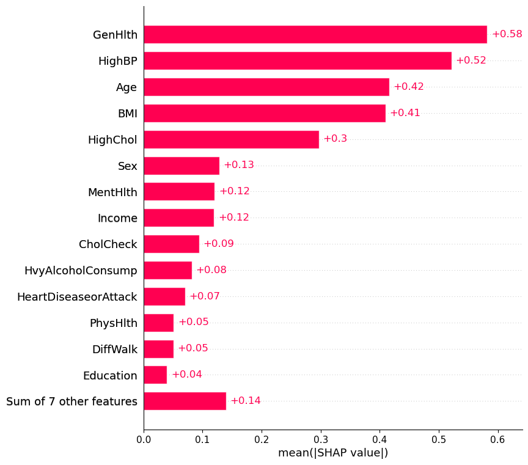
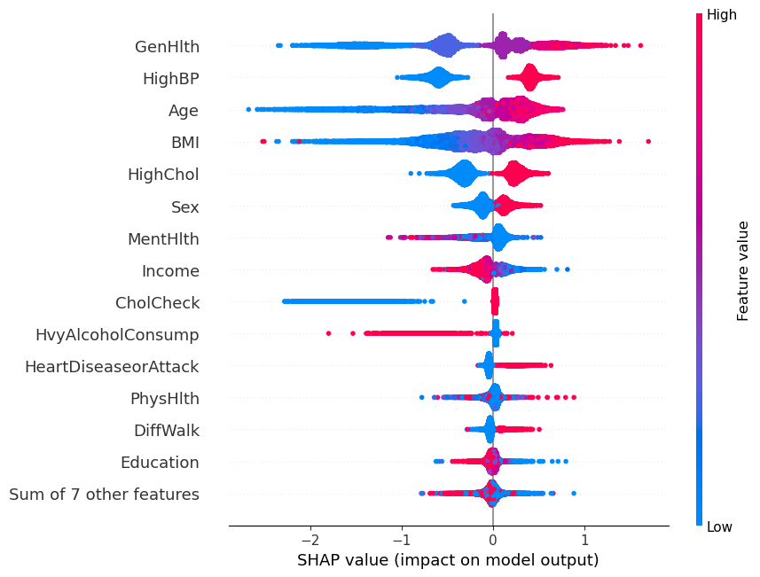

# Diabetes Risk Prediction — CDC Diabetes Health Indicators


Predicting diabetes/prediabetes risk from CDC health survey data using exploratory analysis and
machine learning.

**Author:** [Bhargavi Anupati](https://github.com/BhargaviAnupati) · [LinkedIn](https://www.linkedin.com/in/bhargavi-r-9667b4231/)

## Results at a Glance

**XGBoost achieved a ROC-AUC of 0.815 across 253,680 patient records.** The single strongest
predictor of diabetes risk was self-rated general health, followed by high blood pressure, age,
BMI, and high cholesterol — a ranking that lines up well with established clinical risk factors.

| Top drivers of predicted risk (SHAP) | Direction of effect (SHAP beeswarm) |
|---|---|
|  |  |

## Table of Contents
- [Results at a Glance](#results-at-a-glance)
- [Project Overview](#project-overview)
- [Dataset](#dataset)
- [Methods](#methods)
- [Tech Stack](#tech-stack)
- [Project Structure](#project-structure)
- [How to Run](#how-to-run)
- [Key Takeaways](#key-takeaways)
- [Model Performance](#model-performance)
- [Limitations](#limitations)
- [Next Steps](#next-steps)
- [Author](#author)

## Project Overview

**Business question:** Can we predict which individuals are at elevated risk of prediabetes or
diabetes based on demographic, lifestyle, and health survey indicators? A model like this could
help a clinic or public health program prioritize outreach and screening for at-risk populations.

> **Note:** This is a risk-flagging tool based on self-reported survey data, not a diagnostic
> tool. Predictions should be interpreted as "elevated risk" rather than "diagnosis."

## Dataset

- **Source:** [UCI Machine Learning Repository — CDC Diabetes Health Indicators (ID 891)](https://archive.ics.uci.edu/dataset/891/cdc+diabetes+health+indicators)
- **Origin:** CDC Behavioral Risk Factor Surveillance System (BRFSS), 2015
- **Size:** 253,680 rows, 21 features, 1 binary target
- **Target variable:** `Diabetes_binary` — 0 = no diabetes, 1 = prediabetes or diabetes
- **Feature categories:**
  - Demographics: age, sex, education, income
  - Lifestyle: smoking, physical activity, fruit/vegetable consumption, alcohol use
  - Health conditions: high blood pressure, high cholesterol, heart disease/stroke history, BMI
  - General/mental health: self-rated general health, mental health days, physical health days
  - Healthcare access: has insurance, could not afford doctor visit
- **Known data quality issues:**
  - Significant class imbalance (far more negative than positive cases)
  - ~24,000 duplicate rows in the raw data, removed during cleaning

## Methods

1. **Data Cleaning** ✅
   - Removed ~24,000 duplicate rows
   - Checked and handled missing values
   - Verified data types and value ranges against the feature dictionary

2. **Exploratory Data Analysis (EDA)** ✅
   - Class balance analysis (confirmed significant imbalance toward the negative class)
   - Univariate distributions of key features (BMI, age, general health, etc.)
   - Bivariate analysis: feature relationships with the target
   - Correlation analysis across all features

3. **Feature Engineering** ✅
   - Stratified train/test split (80/20) performed before any scaling, to avoid data leakage
   - Standard scaling applied to continuous features (BMI, MentHlth, PhysHlth, Age, Education, Income), fit on train only
   - Most features were already binary/ordinal and required no additional encoding

4. **Modeling** ✅
   - **Baseline:** Logistic Regression with `class_weight='balanced'`
   - **Comparison models:** Random Forest (`class_weight='balanced'`), XGBoost (`scale_pos_weight`)
   - Class imbalance addressed via class weighting

5. **Evaluation** ✅
   - Precision, recall, F1-score, ROC-AUC compared across all three models at the default 0.5 threshold
   - **Matched-recall comparison:** thresholds adjusted per model so all three are compared at equal recall (~77.5%) — isolates precision differences from threshold effects
   - Confusion matrix and ROC curve analysis, with a focus on minimizing false negatives (missed at-risk patients)

6. **Interpretation** ✅
   - SHAP global feature importance, beeswarm (direction of effect), and individual prediction
     waterfall plots (one high-risk, one low-risk example) for the final XGBoost model

7. **Deployment** — planned
   - Streamlit app for interactive risk prediction based on user-input health indicators

8. **Write-up** ✅ — this README

## Tech Stack

| Category | Tools |
|---|---|
| Language | Python |
| Data handling | pandas, numpy (`<2` — see note below) |
| Visualization | matplotlib, seaborn |
| Modeling | scikit-learn, XGBoost |
| Interpretation | SHAP |
| Deployment | Streamlit (planned) |
| Environment | Jupyter Lab |

> **Note:** `numpy<2` is pinned in `requirements.txt` to avoid a binary-compatibility conflict
> with pandas/numba/SHAP under NumPy 2.x.

## Project Structure

```
diabetes-risk-prediction/
├── README.md
├── requirements.txt
├── data/                                        # raw + processed data (not tracked if large)
├── notebooks/
│   ├── 01_data_loading_and_eda.ipynb                    ✅ complete
│   ├── 02_feature_engineering_and_baseline_model.ipynb  ✅ complete
│   ├── 03_model_comparison_and_evaluation.ipynb         ✅ complete
│   └── 04_model_interpretation_shap.ipynb               ✅ complete
├── src/                                         # reusable functions for cleaning/modeling
├── app/                                         # Streamlit deployment app
└── reports/                                     # figures and write-up assets
```

## How to Run

```bash
# Clone the repo
git clone https://github.com/BhargaviAnupati/CDC-Diabetes-Health-Indicators-Analysis.git
cd CDC-Diabetes-Health-Indicators-Analysis

# Install dependencies
pip install -r requirements.txt

# Launch notebooks
jupyter lab notebooks/01_data_loading_and_eda.ipynb

# Run the Streamlit app (once built)
streamlit run app/app.py
```

## Key Takeaways

- The dataset is meaningfully imbalanced toward non-diabetic respondents, which meant accuracy
  alone would be a misleading metric — precision, recall, F1, and ROC-AUC were used instead
  throughout this project.
- At default thresholds, Logistic Regression, Random Forest, and XGBoost all performed within a
  narrow band of each other (ROC-AUC 0.811–0.816). When compared at a matched recall of ~77.5%
  instead, all three converged even further (F1: 0.447–0.453), indicating the models reached a
  similar predictive ceiling given the available features rather than one architecture being
  clearly superior.
- **Final model selected: XGBoost**, for its narrow edge in precision/F1 at matched recall and
  strong compatibility with SHAP-based interpretation.
- **Top predictive features (from SHAP):** self-rated general health was the single strongest
  driver of predicted risk, followed by high blood pressure, age, BMI, and high cholesterol —
  a ranking that lines up well with established clinical diabetes risk factors. Higher values of
  each (worse self-rated health, having high BP, older age, higher BMI, having high cholesterol)
  consistently pushed predictions toward higher risk.
- **One notable, counterintuitive finding:** heavy alcohol consumption was associated with
  *lower* predicted risk in the SHAP analysis. This is a known pattern in this dataset rather
  than a modeling error — it likely reflects a "healthy drinker" confounding effect (heavy
  drinkers in survey data skew younger and healthier on other dimensions) rather than alcohol
  itself being protective. Worth stating explicitly rather than over-interpreting.
- **Practical implication:** a screening tool using this model could flag a substantial share of
  at-risk individuals based on easily self-reported indicators (general health rating, blood
  pressure, age, BMI, cholesterol) without requiring lab work, though any real deployment would
  need clinical validation given the survey-based, non-diagnostic nature of the underlying data.

## Model Performance

**At default (0.5) threshold:**

| Model | Precision | Recall | F1 | ROC-AUC |
|---|---|---|---|---|
| Logistic Regression | 0.318 | 0.760 | 0.449 | 0.811 |
| Random Forest | 0.334 | 0.743 | 0.461 | 0.816 |
| XGBoost | 0.320 | 0.775 | 0.453 | 0.815 |

**At matched recall (~77.5%)** — thresholds adjusted per model so recall is held constant,
isolating true precision differences from threshold effects:

| Model | Threshold | Precision | Recall | F1 |
|---|---|---|---|---|
| Logistic Regression | 0.488 | 0.314 | 0.775 | 0.447 |
| Random Forest | 0.473 | 0.319 | 0.775 | 0.452 |
| XGBoost | 0.500 | 0.320 | 0.775 | 0.453 |

**Selected model: XGBoost.** At matched recall, all three models perform nearly identically,
with XGBoost holding a narrow edge in precision and F1. Given the near-tie, the deciding factors
were this small edge plus XGBoost's strong compatibility with SHAP for model interpretation.

## Limitations

- Data is self-reported survey data (BRFSS), not clinical records — subject to recall and
  reporting bias.
- The target combines prediabetes and diabetes into a single class, so the model cannot
  distinguish between the two conditions.
- Model reflects patterns in 2015 U.S. survey data and may not generalize to other populations
  or time periods.
- All three core models converged on a similar performance ceiling (~0.81–0.82 ROC-AUC),
  suggesting that further gains are more likely to come from better features or external data
  than from additional algorithms.
- The counterintuitive heavy-alcohol-consumption finding is a good reminder that SHAP explains
  what the model learned, not necessarily true causal relationships in the real world.

## Next Steps

- [x] Complete EDA and document key findings
- [x] Engineer features and build baseline model
- [x] Train and compare additional models
- [x] Generate SHAP interpretation plots and document findings
- [ ] Build and deploy Streamlit app
- [x] Write up plain-English summary for non-technical audiences

## Author

**Bhargavi Anupati**
[LinkedIn](https://www.linkedin.com/in/bhargavi-r-9667b4231/) · [GitHub](https://github.com/BhargaviAnupati)

## License

This project is licensed under the [MIT License](LICENSE).
