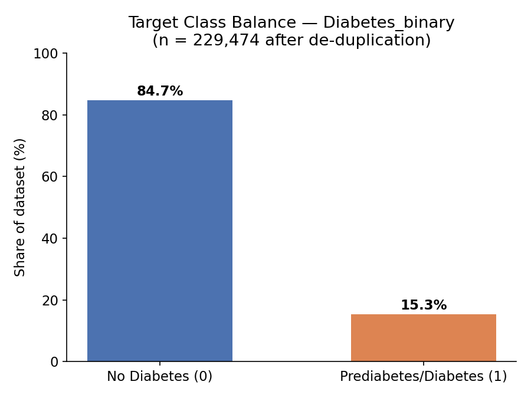
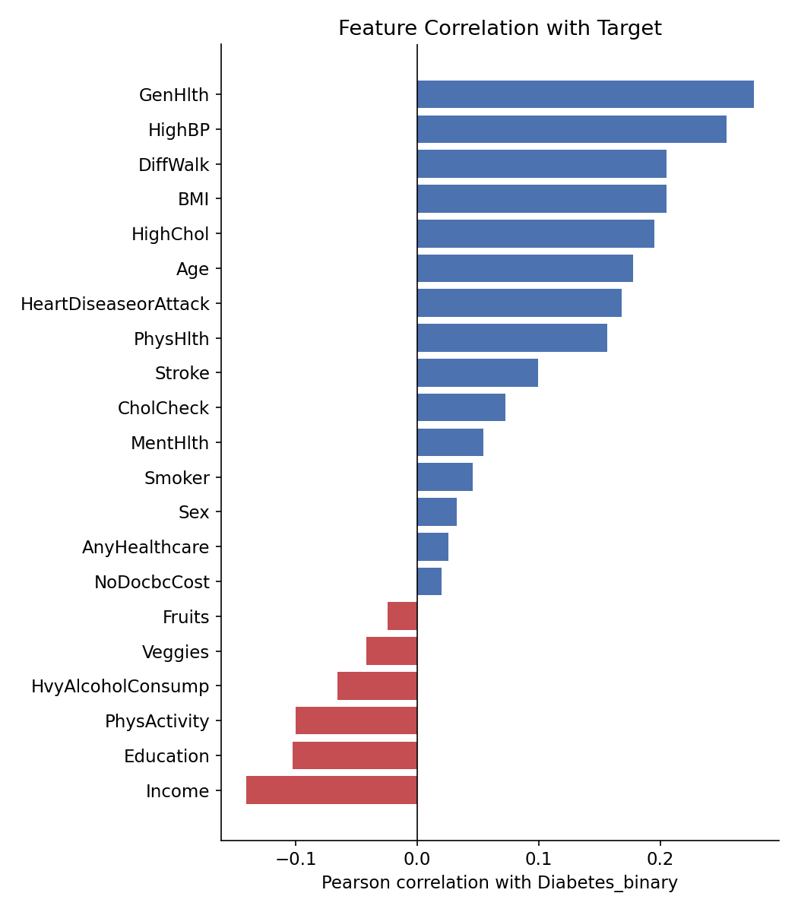
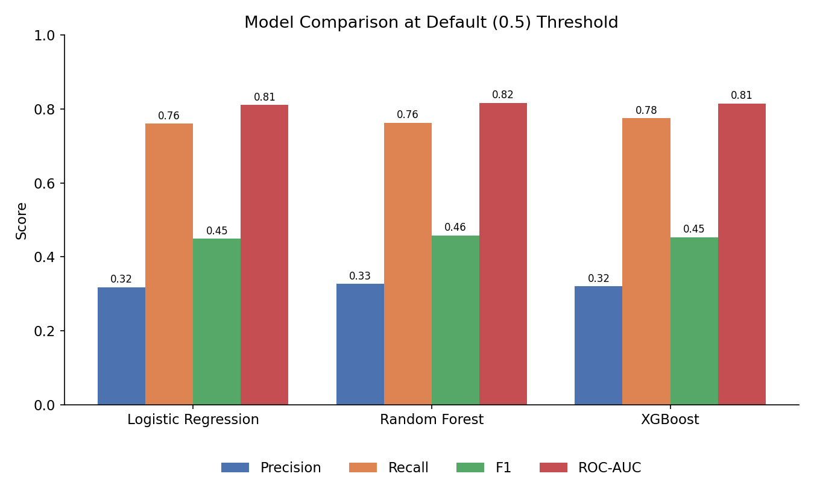
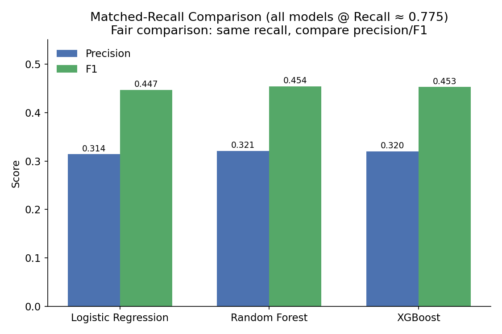

# CDC Diabetes Risk Prediction — Final Report

**Author:** Bhargavi Anupati
**Dataset:** CDC Diabetes Health Indicators (UCI ML Repository, id 891; 2015 BRFSS survey)
**Notebooks:** [`01_data_loading_and_eda.ipynb`](../notebooks/01_data_loading_and_eda.ipynb) · [`02_feature_engineering_and_baseline_model.ipynb`](../notebooks/02_feature_engineering_and_baseline_model.ipynb) · [`03_model_comparison_and_evaluation.ipynb`](../notebooks/03_model_comparison_and_evaluation.ipynb) · [`04_model_interpretation_shap.ipynb`](../notebooks/04_model_interpretation_shap.ipynb)

---

## 1. Problem Statement

Diabetes and prediabetes affect a large share of the U.S. adult population,
and many cases go undiagnosed until complications appear. This project asks:
**can a small set of readily available health-survey indicators (no lab
work required) predict whether a person has diabetes or prediabetes?**

A model like this is not a diagnostic tool — it's a low-cost **screening
signal**: something a health system could use to flag people who should be
prioritized for an actual clinical test, using only questionnaire-style data
that's already cheap to collect at scale.

Because the actual cost of a **missed at-risk patient (false negative)** is
higher than the cost of an unnecessary follow-up test (false positive), this
project treats **recall on the positive class as the metric that matters
most**, and evaluates precision/F1 relative to a fixed recall target rather
than at an arbitrary default threshold.

## 2. Data

- **Source:** CDC Diabetes Health Indicators, UCI ML Repository id 891, fetched via the `ucimlrepo` package.
- **Raw shape:** 253,680 rows × 22 columns (21 features, 1 target `Diabetes_binary`).
- **Data quality:** zero missing values in any column. 24,206 exact duplicate rows (9.5%) were found and dropped, leaving **229,474 rows**.
- **Target:** `0` = no diabetes (84.7%), `1` = prediabetes or diabetes (15.3%) — a meaningfully imbalanced target.
- **Features:** a mix of binary indicators (e.g. `HighBP`, `Smoker`, `PhysActivity`), ordinal self-report scales (`GenHlth`, `Age`, `Education`, `Income`), and a few integer counts (`BMI`, `MentHlth`, `PhysHlth`). Full column definitions are in [`data/README.md`](../data/README.md).

### Which features correlate most with diabetes status?

Simple Pearson correlation with the target already points to the strongest
signals before any modeling: self-rated general health, high blood
pressure, difficulty walking, BMI, and high cholesterol all correlate
positively with diabetes status; income and education correlate negatively.

## 3. Methodology

### 3.1 Train/test split

An 80/20 **stratified** split (`random_state=42`) was used throughout the
project so that train and test sets preserve the same ~85/15 class ratio,
and so results are directly comparable across notebooks 02–04:

- Train: 183,579 rows
- Test: 45,895 rows

The split was performed **before** any scaling or resampling to avoid data
leakage.

### 3.2 Feature engineering

Most features are already binary or ordinal, so engineering was light:

- Continuous features (`BMI`, `MentHlth`, `PhysHlth`, `Age`, `Education`, `Income`) were standardized with `StandardScaler`, **fit on the training set only** and applied to both train and test.
- Tree-based models (Random Forest, XGBoost) were trained on the **unscaled** features, since tree splits are invariant to monotonic scaling — only Logistic Regression used the scaled version.

### 3.3 Handling class imbalance

Rather than synthetic resampling (e.g. SMOTE), this project uses **cost-sensitive
learning**, which avoids introducing synthetic data points:

- Logistic Regression, Random Forest → `class_weight='balanced'`
- XGBoost → `scale_pos_weight` = negative-count / positive-count ≈ **5.54**

### 3.4 Models compared

| Model | Key hyperparameters |
|---|---|
| Logistic Regression (baseline) | `class_weight='balanced'`, `max_iter=1000` |
| Random Forest | `n_estimators=300`, `max_depth=12`, `class_weight='balanced'` |
| XGBoost | `n_estimators=300`, `max_depth=6`, `learning_rate=0.1`, `scale_pos_weight≈5.54` |

## 4. Results

### 4.1 Default threshold (0.5) comparison

| Model | Precision | Recall | F1 | ROC-AUC |
|---|---|---|---|---|
| Logistic Regression | 0.318 | 0.760 | 0.449 | 0.811 |
| Random Forest | 0.327 | 0.763 | 0.458 | **0.817** |
| XGBoost | 0.320 | **0.775** | 0.453 | 0.815 |

At the default threshold, all three models land in a similar range — none
dominates outright. XGBoost has the highest recall out of the box; Random
Forest has the best ROC-AUC and a slight edge on precision/F1.

### 4.2 Threshold tuning

The default 0.5 cutoff isn't necessarily the right operating point for an
imbalanced screening problem. Lowering XGBoost's threshold to **0.35** trades
precision for a substantial recall gain:

| Threshold | Precision | Recall | F1 |
|---|---|---|---|
| 0.50 (default) | 0.320 | 0.775 | 0.453 |
| 0.35 | 0.270 | 0.890 | 0.410 |

This confirms the precision/recall tradeoff is real and tunable — useful if
a deployment ever needs to prioritize catching more at-risk patients at the
cost of more follow-up tests.

### 4.3 Matched-recall comparison (the fair comparison)

Because the three models sit at *different* recall levels at their default
thresholds, comparing their default-threshold precision isn't quite
apples-to-apples. To fix this, each model's threshold was tuned so all three
hit the **same recall (~0.775**, XGBoost's default-threshold recall), then
precision/F1 were compared at that matched point:

| Model | Threshold | Precision | Recall | F1 |
|---|---|---|---|---|
| Logistic Regression | 0.488 | 0.314 | 0.775 | 0.447 |
| **Random Forest** | 0.490 | **0.321** | 0.775 | **0.454** |
| XGBoost | 0.500 | 0.320 | 0.775 | 0.453 |

At matched recall, **Random Forest and XGBoost are effectively tied**
(within 0.001 F1 of each other), and both modestly outperform Logistic
Regression. This is the more trustworthy comparison of the two tables above.

### 4.4 Final model choice

**XGBoost** was selected as the final model, carried forward into the
interpretation stage (Section 5). Justification:

- Performance is statistically indistinguishable from Random Forest at
  matched recall (Section 4.3), and XGBoost has the best out-of-the-box
  recall at the default threshold, which matters most for this
  screening use case.
- XGBoost's threshold is easily tunable (Section 4.2) to trade precision for
  recall as deployment needs change, without retraining.
- It scales efficiently to the full ~230k-row dataset and pairs naturally
  with `shap.TreeExplainer` for fast, exact interpretability (Section 5).

That said, **Random Forest is a fully competitive alternative** — if
interpretability tooling or infra favored it, swapping it in would cost
almost nothing in predictive performance.

## 5. Model Interpretation (SHAP)

To understand *why* the final XGBoost model makes the predictions it does,
SHAP (`TreeExplainer`) was applied to a 15,000-row sample of the test set.
See [`notebooks/04_model_interpretation_shap.ipynb`](../notebooks/04_model_interpretation_shap.ipynb)
for the full global importance, beeswarm, waterfall, and dependence plots.

**How to read the notebook's SHAP outputs:**

- The **bar plot** (Section 3) ranks features by mean absolute SHAP value —
  which features move the model's predictions the most, in either direction.
- The **beeswarm plot** (Section 4) adds direction: for each top feature, it
  shows whether high or low values of that feature push predicted risk up or
  down.
- The **waterfall plots** (Section 5) walk through one high-risk and one
  low-risk individual prediction, showing exactly which feature values
  pushed that specific prediction away from the model's average output.
- The **dependence plots** (Section 6) — for `BMI`, `GenHlth`, `Age`, and
  `HighBP` — show how each feature's value relates to its SHAP impact, and
  whether it interacts with another feature.

Consistent with the correlation analysis in Section 2, general health
rating, blood pressure status, BMI, and age are expected to dominate the
global importance ranking — SHAP confirms not just that these matter, but
*how*: e.g. a self-rated "poor" general health consistently pushes
predicted risk up, while higher income/education modestly pushes it down.

*(Exact per-feature SHAP magnitudes depend on the specific 15,000-row test
sample drawn at run time; re-run notebook 04 to reproduce the current
figures for a portfolio screenshot.)*

## 6. Limitations

- **Self-reported survey data.** BRFSS is a phone survey; all features
  (including BMI) are self-reported, which introduces recall and
  social-desirability bias.
- **Binary target collapses two conditions.** `Diabetes_binary` groups
  prediabetes and diabetes together, and cannot distinguish Type 1 from
  Type 2 diabetes.
- **Precision is inherently limited by class imbalance.** Even a fairly
  capable model tops out around 30–33% precision on the positive class,
  meaning roughly 2 in 3 people flagged as "at risk" would not actually have
  diabetes/prediabetes. This is expected and acceptable for a low-cost
  screening signal (where a false positive just means "get an actual
  test"), but the model should **not** be framed as diagnostic.
- **No external validation set.** All evaluation is on a held-out split of
  the same 2015 BRFSS sample; performance on more recent or non-U.S.
  populations is untested.

## 7. Conclusion

A small set of self-reported health indicators can identify a meaningful
share of individuals with diabetes/prediabetes: the final XGBoost model
achieves **ROC-AUC ≈ 0.815** and, at a recall of ~77.5%, a precision of
~32%. Tree-based models (Random Forest and XGBoost) modestly but
consistently outperform the logistic regression baseline, and SHAP analysis
confirms the model's reasoning tracks clinically sensible signals (general
health, blood pressure, BMI, age) rather than spurious correlations. With
threshold tuning, the model can be pushed toward higher recall (catching
more at-risk individuals) at a known, quantified precision cost —
making it a plausible low-cost pre-screening layer ahead of clinical
testing, not a replacement for one.
